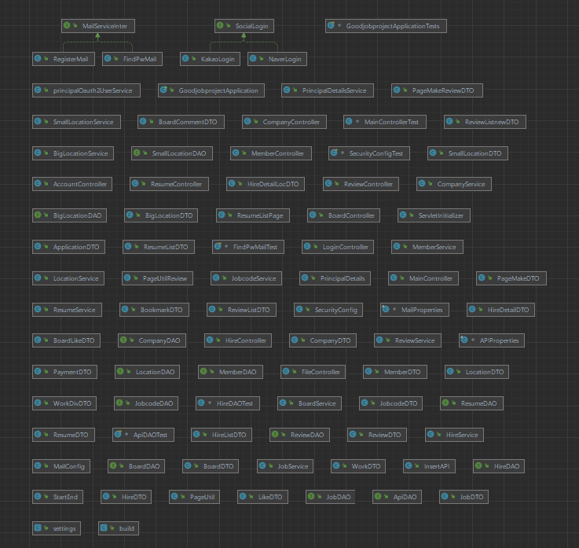
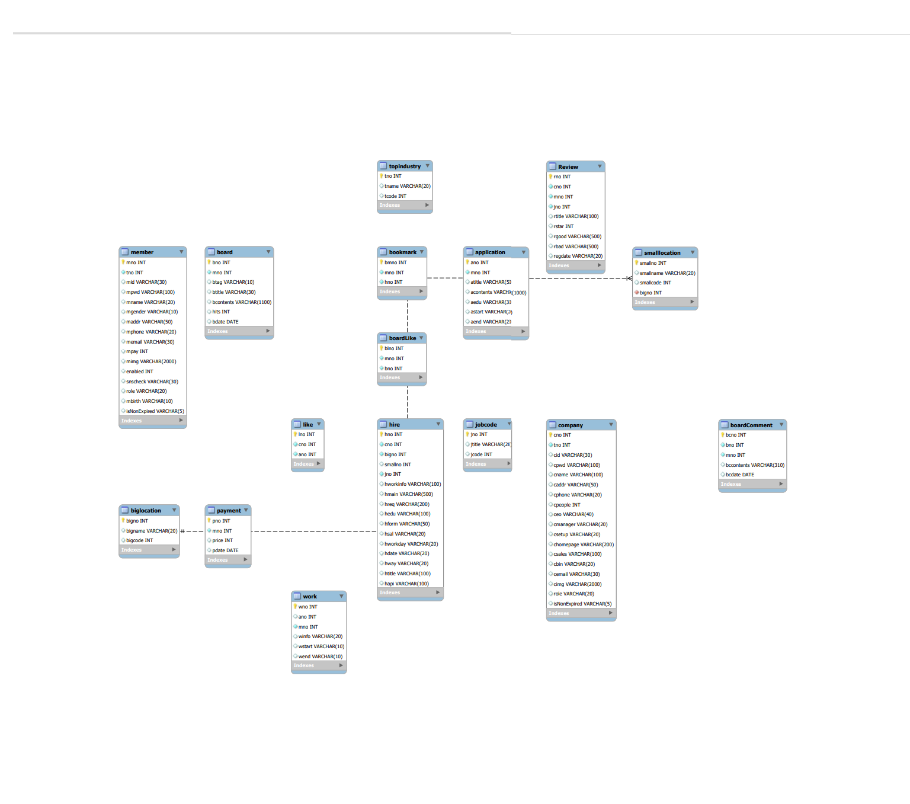
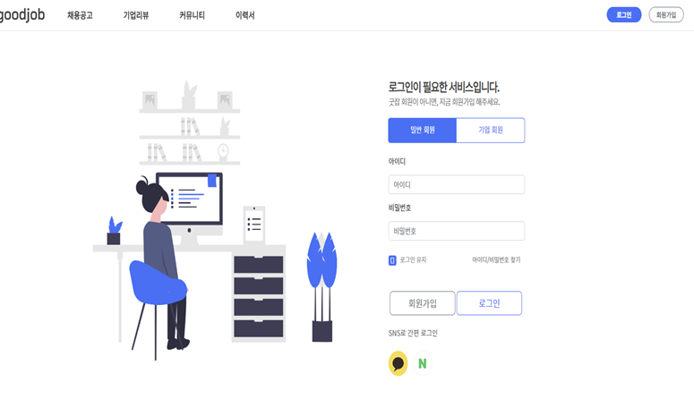
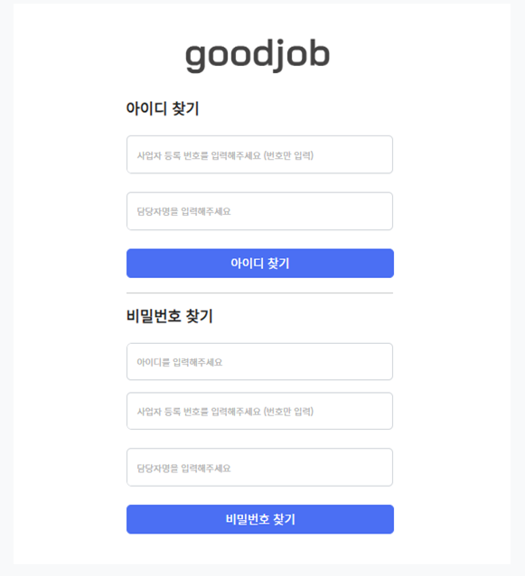
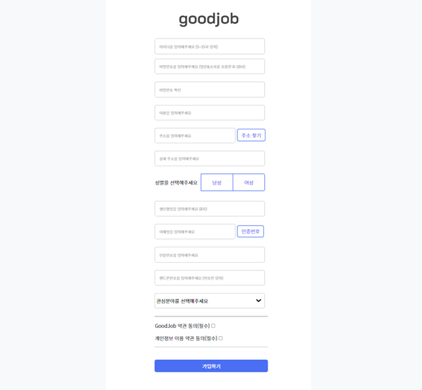
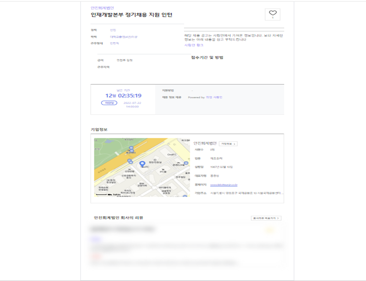

# goodJob : 취업 정보 제공 사이트

## 1. 개요
- 사람인 API 와 공공데이터 포털의 회사 정보 제공 API 를 사용해
    취업 정보 및 회사 정보 제공을 위한 사이트 개발

## 2. 사용 기술
- Java 8 
- Spring Boot MVC
- Gradle 
- Ajax, JQuery
- MySQL - RDS
- jsp

## 3. 다이어그램

## 4. DB ERD

## 5. 공부 목표 및 담당 기능
- API 데이터 파싱
  - 사람인 API 와 회사 정보 API 데이터 파싱 및 DB 연결

- 소셜 로그인
  - SpringSecurity 를 사용한 네이버 및 카카오 소셜 로그인 후 회원 정보 DB 저장

- 메일 서비스
  - 회원 가입 시 지정한 메일로 확인 인증 번호 발송
  - 비밀 번호 찾기 시 지정한 메일로 임시 비밀번호 발송

-AJAX 를 사용한 아이디 중복 확인 및 메일 인증 번호 체크

## 6. 구현 화면

